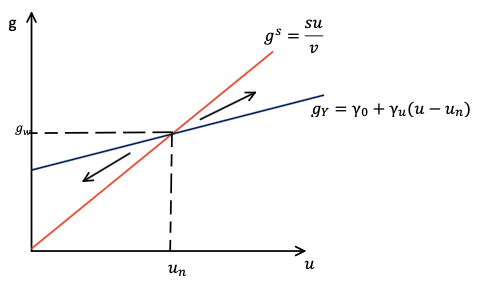

# O Modelo de Harrod: Dinâmica, Instabilidade e Crescimento {#sec-modelo-harrod}

## Introdução {#sec-introducao-harrod}

A *Teoria Geral do Emprego, do Juro e da Moeda* de Keynes representou um avanço fundamental ao demonstrar que a economia capitalista não possui mecanismos automáticos de ajuste em direção ao pleno emprego. No entanto, a análise de Keynes concentrou-se no curto prazo e no nível de renda, deixando em aberto a questão de como sua teoria poderia ser estendida para o longo prazo e para o estudo das taxas de crescimento.

Foi Roy Harrod (1939) em um trabalho intitulado "An Essay in Dynamic Theory", quem deu os primeiros passos nessa direção. Harrod tinha como objetivo transpor a análise estática da *Teoria Geral* para uma teoria dinâmica, ou seja, uma teoria preocupada não com os *níveis* das variáveis econômicas, mas com suas *taxas de crescimento*.

O modelo de Harrod, embora não tenha se consolidado como uma teoria completa de crescimento e distribuição, estabeleceu as bases para o desenvolvimento de toda uma tradição de pensamento econômico. A intenção de Harrod não era bem estudar as causas do crescimento econômico, mas mostrar como o sistema capitalista é inerentemente instável mesmo no longo prazo.

## O equilíbrio estático como ponto de partida {#sec-estatico-harrod}

Keynes elabora sobre o princípio da demanda efetiva separando sua análise em elementos *ex-ante* e *ex-post*. Sendo que a produção e o emprego são determinados *ex-ante* a partir de expectativas de demanda sobre a venda que só se materializará no futuro. Paul Davidson resume esta análise expondo que a "produção leva tempo".

Para evitar jargões como *ex-ante* e *ex-post*, no box abaixo vamos explicar esta análise imaginando um produtor que passa a semana produzindo e no final de semana vai ao mercado vender o que produziu em sua fábrica. Chamaremos a semana de "período de produção" e o final de semana de "período de mercado".

:::callout-important
**Período de produção** $\rightarrow$ é o período em que o empresário produz com base em expectativas de venda.

**Período de mercado** $\rightarrow$ é o período em que o empresário conhece a demanda efetiva pelo seu produto.
:::

Para decidir o quanto produzir, o empresário formula o que Keynes chamou de expectativas de curto-prazo, isto é, expectativas sobre qual será a demanda por seu produto no período de mercado. Ele toma esta decisão planejando acumular um dado nível de estoque, mas ao chegar no período de mercado, suas expectativas podem se mostrar erradas.

:::callout-note
## Exemplo didático

Imagine que o empresário produza 10 unidades esperando vender apenas 8 e planejando acumular 2 unidades de estoque. 

Ao chegar no mercado no final de semana, a demanda pelo propduto supera suas expectativas, de tal forma que ele vende todas as 10 unidades produzidas. Nesta circunstância, vemos que a variação tivemos uma variação não planejada do estoque.

Agora, o empresário voltará para sua fábrica e ajsutará suas expectativas de curto prazo. Ele vai, por exemplo, passar a produzir 12 unidades, planejando vender 10 e acumular 2 unidades como estoque.

:::callout-important
Repare que neste exemplo, a oferta está se ajustando à demanda. Temo o princípio da dmenada efetiva revertendo a lei de Say.
:::

O estado estacionário ocorrerá no nível em que a demanda efetiva satisfazer as expectativas de curto prazo do empresário. Vamos supor que ele chege ao mercado novamente e se depare com uma demanda efetiva por seu produto de 10 unidades, acumulando 2 unidades de estoque, tal como planejado. Agora, ele não terá incentivos para reajustar sua produção, já que o efetivo e o planejado estão coincidindo.

Contudo, se para produzir estas 12 unidades, o empresário precisa contratar apenas 90% da força de trabalho disponível, o desemprego será consequência da baixa demanda efetiva. Diferente do modelo neoclássico de determinação da renda, reduzir os salários reais não fará a demanda por trabalho das firmas subir. Para Keynes, o empresário não contratará mais trabalhadores só porque está "barato", ele contratará tão somente o necessário para produzir a quantidade que espera ser demandada a um preço rentável. 
:::

Os economistas pós-keynesianos expressam a relação explicada acima dizendo que em uma economia monetária da produção, a condição de maximização dos lucros monetários pode ocorrer ainda que o salário permaneça abaixo da produtividade marginal do trabalho. Afinal, pode não compensar para o empresário demandar mais trabalho se não ele não espera vender a produção extra do trabalho a ser contratado.

Juntando esta abrodagem de expectativas com o que foi apresentado na @sec-contabilidade e, principalmente com o que vimos na @eq-Y e na @eq-g-equilibrio, vamos nos debruçar sobre o exercício de Harrod.

## A transição para a dinâmica: o problema do investimento recorrente {#sec-dinamica-harrod}

A questão que Harrod se colocou foi a seguinte: se o investimento varia
constantemente ao longo do tempo, como podemos preservar o resultado de
equilíbrio estático em um contexto dinâmico? Em outras palavras, o que é
necessário para que a igualdade $I = S$ se mantenha em cada período?

A resposta de Harrod envolve a consideração de que, no longo prazo, o
investimento tem um efeito duplo:

1.  **Efeito demanda**: o investimento gera renda pelo multiplicador
    keynesiano.
2.  **Efeito capacidade**: o investimento expande o estoque de capital
    e, portanto, a capacidade produtiva da economia.

Para que o equilíbrio seja mantido ao longo do tempo, a renda gerada
pelo investimento deve crescer na mesma proporção que a capacidade
produtiva expandida. Isso requer que a *taxa de crescimento do
investimento* (e, portanto, do estoque de capital) seja igual à *taxa de
crescimento da poupança*.

Formalmente, partindo da condição de equilíbrio $I = S$, temos:

$$\begin{aligned}
I &= \Delta K\\
& e\\
S &= sY
\end{aligned}$$

Dividindo ambos os lados da igualdade pelo estoque de capital ($K$),
obtemos:

$$\frac{I}{K} = \frac{S}{K}$$

$$\frac{\Delta K}{K} = \frac{sY}{K}$$

O lado esquerdo da equação é a taxa de crescimento do estoque de capital
($g_K$). O lado direito pode ser decomposto em:

$$\frac{sY}{K} = s \frac{Y}{K}$$

Sabendo que a relação capital-produto efetiva é $v = K/Y$, temos que
$Y/K = u/v$, onde $u$ é o grau de utilização da capacidade produtiva.
Assim:

$$\frac{sY}{K} = \frac{s u}{v}$$

Portanto, a condição de equilíbrio dinâmico pode ser expressa como:

$$\boxed{g_K = g_S = \frac{s u}{v}}$$ {#eq-gs-harrod}

onde $g_S$ é a taxa de crescimento da poupança (ou a taxa de poupança
normalizada pelo estoque de capital).

## A taxa efetiva de crescimento {#sec-efetiva-harrod}

Se o estoque de capital e a renda crescem à mesma taxa no equilíbrio,
temos que a taxa efetiva de crescimento da renda ($g_Y$) é igual à taxa
de crescimento do estoque de capital ($g_K$):

$$\boxed{g_Y = g_K = g_S = \frac{s u}{v}}$$ {#eq-gy-harrod}

A @eq-gy-harrod nos mostra que a taxa efetiva de crescimento da economia
é determinada por três fatores:

1.  a propensão a poupar ($s$);
2.  o grau de utilização da capacidade produtiva do período ($u$);
3.  a relação capital-produto ($v$).

::: callout-note
### A decomposição da taxa efetiva

A equação $g_Y = \frac{s u}{v}$ pode ser decomposta em dois componentes:

- o **efeito multiplicador**, representado pela propensão a poupar
  ($s$);
- o **efeito acelerador**, representado pela relação capital-produto
  ($v$).

O grau de utilização ($u$) atua como um termo de ajuste que reflete o
quão intensamente o estoque de capital existente está sendo utilizado.
:::

Um ponto a se notar é que o efeito acelerador, nesta versão simples, deve ser representado pela letra $v$, já que busca medir o quanto que mudanças do investimento afetam a capacidade produtiva. Isto pode ser verificado se partirmos da definição de $v$ e isolarmos o investimento:

$$
\begin{aligned}
v= \frac{K}{Y_K}\\
Y_K v = K
\end{aligned}$$

Pegando o diferencial dos dois lados e considerando que $\Delta K = I$:
$$\Delta Y_K v = I$$
Aqui fica nítido que o $v$ está medindo a magnitude do impacto do investimento sobre a capacidade produtiva da economia, refletindo a questão do investimento se convertendo em oferta no futuro.

O caráter dual do investimento vem do fato de ele ser demanda hoje (o efeito multiplicador captura isso) e oferta no futuro (o efeito acelerador considera isso).

## A taxa desejada (ou garantida) de crescimento {#sec-garantida-harrod}

Harrod introduziu um conceito fundamental: a *taxa desejada de
crescimento* ($g_W$). Esta é a taxa de crescimento que, se ocorrer,
deixará todos os agentes satisfeitos por terem produzido exatamente a
quantidade certa. Em suas próprias palavras:

> "The line of output traced by the warranted rate of growth is a moving
> equilibrium, in the sense that it represents the one level of output
> at which producers will feel in the upshot that they have done the
> right thing, and which will induce them to continue in the same line
> of advance." (Harrod 1939, p. 22)

A taxa garantida é aquela compatível com as expectativas de curto-prazo dos
empresários. Ela ocorre quando o grau de utilização efetivo ($u$) é
igual ao grau de utilização desejado ou normal ($u_n$), ou seja, aquele
nível de utilização que as firmas consideram adequado para suas decisões
de investimento.

Aqui é impossível deixar de fazer analogia com o que foi discutido no box da @sec-estatico-harrod. Conforme apresentamos no exemplo didático, a estabildiade das expectativas dos agentes está relacionada com o fato de a demanda efetiva coincidir com a variação planejada dos estoques. Passando da análise de nível da renda para a análise da taxa de crescimento, temos que a estabilidade do sistema ocorre quando a taxa efetiva do grau de utilização iguala à taxa planejada, àquela em que as expectativas dos agentes estariam sendo satisfeitas.

Particularmente, eu acho estranho os economistas chamarem esta taxa de "normal", mas podemos facilmente enxergar o que Harrod tinha em mente se pensarmos que seu objetivo era passar a teoria estática de Keynes para uma análise dinâmica. Neste caso, em vez de falar em nível de demanda esperado no período de produção em relação ao período de mercado, podemos falar em um grau de utilização da capacidade instalada planejado $(u_n)$.

Substituindo $u = u_n$ na @eq-gy-harrod, obtemos:

$$\boxed{g_W = \frac{s u_n}{v}}$$ {#eq-gw-harrod}

onde:

- $s$ é a propensão a poupar (efeito multiplicador);
- $u_n$ é o grau desejado de utilização da capacidade;
- $v$ é a relação capital-produto (efeito acelerador).

::: callout-important
### A composição da taxa garantida

A taxa garantida de crescimento pode ser interpretada como o resultado
da interação entre dois princípios fundamentais:

1.  **O princípio do multiplicador**: representado por $s$. Uma maior
    propensão a poupar implica que uma dada variação no investimento
    gera menos renda, reduzindo a taxa garantida.

2.  **O princípio do acelerador**: representado por $v$. Uma maior
    relação capital-produto significa que as firmas precisam investir
    mais para expandir sua capacidade produtiva, reduzindo a taxa
    garantida.
:::

Graficamente, o equilíbrio dinâmico ocorre no ponto de interseção entre
a curva de poupança ($g_S = \frac{s u}{v}$) e a curva de investimento
($g_Y$). Neste ponto, a taxa efetiva de crescimento se iguala à taxa
garantida e o grau de utilização coincide com o nível desejado pelas
firmas.

{#fig-equilibrio-harrod
width="75%"}

É importante notar que a condição para o equilíbrio acontecer é:
$$ 
\begin{aligned}
g_y &= g_W\\
\frac{su}{v}&=\frac{s u_n}{v}
\end{aligned}
$$
O que nos leva à condição de:
$$
\begin{aligned}
u &= u_n\\
\frac{Y}{Y_K} &= \frac{Y_n}{Y_K}\\
Y &= Y_n
\end{aligned}$$

Ou seja, que o nível de demanda efetiva convirja para o nível esperado, tal como discutido nas expectativas de curto-prazo.

## A taxa natural de crescimento {#sec-natural-harrod}

Além da taxa efetiva e da taxa desejada, Harrod introduziu uma terceira
taxa: a *taxa natural de crescimento* ($g_n$). Esta taxa representa o
limite máximo de crescimento imposto pelo lado da oferta, ou
seja, pelas condições de disponibilidade de fatores de produção.

Imagine uma pequena aldeia. Sua capacidade produtiva dependerá
fundamentalmente de duas coisas:

1.  **Da quantidade de pessoas existentes**: mais trabalhadores
    disponíveis permitem produzir mais.
2.  **Da tecnologia utilizada na produção**: melhores técnicas
    produtivas aumentam a produtividade do trabalho.

Portanto, o crescimento da capacidade produtiva desta aldeia dependerá
do crescimento populacional e do desenvolvimento tecnológico.
Formalmente:

$$\boxed{g_n = g_L + g_A}$$ {#eq-gn-harrod}

onde:

- $g_L$ é a taxa de crescimento da força de trabalho (população);
- $g_A$ é a taxa de progresso tecnológico (aumento da produtividade).

Harrod assumiu que a tecnologia é do tipo *Harrod-neutra*, o que
significa que:

1.  a relação capital-produto ($v$) permanece constante;
2.  a distribuição funcional da renda não é afetada pelo progresso
    técnico;
3.  o produto cresce proporcionalmente ao crescimento tecnológico.

## O primeiro problema de Harrod: a instabilidade da taxa garantida {#sec-primeiro-problema-harrod}

O modelo de Harrod apresenta o que a literatura convencional chama de
"primeiro problema": a instabilidade da taxa garantida de crescimento.

O problema pode ser enunciado da seguinte forma: o ponto de equilíbrio
definido pela igualdade $g_Y = g_W$ é estável? A resposta de Harrod é
negativa. Sempre que a taxa efetiva de crescimento se desvia da taxa
garantida, forças centrífugas atuam para ampliar o desvio, e não para
corrigi-lo.

### O mecanismo da instabilidade

Para entender a instabilidade, precisamos incorporar ao modelo o
*princípio do acelerador*. Harrod propôs uma função de investimento em
que a taxa efetiva de crescimento depende da diferença entre o grau de
utilização efetivo e o grau de utilização normal:

$$g_Y = \gamma_0 + \gamma_u (u - u_n), \quad \gamma_0, \gamma_u > 0$$ {#eq-acelerador-harrod}

onde:

- $\gamma_0$ é a taxa de crescimento autônoma (ou componente de
  expectativas representando o "espírito animal");
- $\gamma_u$ mede a sensibilidade do investimento a desvios do grau de
  utilização em relação ao desejado;
- $(u - u_n)$ é o desvio do grau de utilização.

Além disso, Harrod assumiu que as expectativas se ajustam de acordo com
o desvio observado:

$$\Delta \gamma_0 = v (u - u_n)$$ {#eq-ajuste-expectativas}

A intuição por trás desse mecanismo é a seguinte:

1.  Se $u > u_n$ (economia operando acima da capacidade planejada), as
    firmas observam que estão vendendo mais do que o planejado, verificando variações não desjeadas de seus estoques.
2.  Isso melhora suas expectativas de demanda futura.
3.  Elas decidem acelerar o investimento para expandir a capacidade
    produtiva.
4.  O aumento do investimento aquece ainda mais a economia, elevando
    ainda mais o grau de utilização.
5.  O processo se retroalimenta, afastando a economia cada vez mais do
    equilíbrio.

O oposto também é verdadeiro: se $u < u_n$, as firmas observam que estão
vendendo menos do que o planejado, pioram suas expectativas, reduzem o
investimento, a economia desacelera e o grau de utilização cai ainda
mais.

::: callout-warning
### Por que a instabilidade é um problema?

A instabilidade é considerada um problema porque torna o modelo de
Harrod pouco útil para a análise empírica. Se o equilíbrio é instável, a
economia tenderá a se afastar dele sempre que ocorrer um desvio mínimo,
o que torna a trajetória de equilíbrio uma "faca de dois gumes"
(*knife-edge*).

Em outras palavras: se a economia não estiver exatamente sobre a
trajetória de crescimento garantido, ela tende a explodir para cima
(euforia) ou para baixo (frustração).

:::

### Representação gráfica da instabilidade

Graficamente, o primeiro problema de Harrod pode ser representado da
seguinte forma:

::::: columns
::: {.column width="35%"}
{#fig-instabilidade-harrod
width="100%"}
:::

::: {.column width="65%"}
No ponto $A$, a curva de poupança ($g_S$) e a curva de investimento
$(g_Y)$ se interceptam no grau normal de utilização ($u_n$). Este é o
equilíbrio.

No entanto, suponha que, por alguma razão, a curva de investimento se
desloque para $g_Y^1$. O novo equilíbrio ocorre em $B$, com um grau de
utilização $u_1 > u_n$. As firmas observam que estão vendendo mais do
que o esperado, melhoram suas expectativas, e a curva de investimento se
desloca para $g_Y^2$, gerando um novo equilíbrio com $u_2 > u_1$. O
processo se repete, afastando cada vez mais a economia do equilíbrio
inicial.

Analogamente, se a curva de investimento se deslocasse para baixo,
o processo operaria em sentido contrário, com a economia se afastando
para baixo.

Em seu ensaio, Harrod resume este resultado da seguinte forma:
:::

> "The dynamic theory so far stated may be summed up in two
> propositions. (i) A unique warranted line of growth is determined
> jointly by the propensity to save and the quantity of capital required
> by technological and other considerations per unit increment of total
> output. Only if producers keep to this line will they find that on
> balance their production in each period has been neither excessive nor
> deficient. (ii) On either side of this line is a 'field' in which
> centrifugal forces operate, the magnitude of which varies directly as
> the distance of any point in it from the warranted line. Departure
> from the warranted line sets up an inducement to depart farther from
> it. The moving equilibrium of advance is thus a highly unstable one."
> (Harrod 1939, p. 23)

Representando a dinâmica por um diagrama de fases, temos a @fig-fases-harrod.

{#fig-fases-harrod
width="75%"}

Em que notamos que qualqeur ponto inicial em que a demanda efetiva não seja compatível com as expectativas dos agentes conduz a economia para um processo explosivo. Portanto, é possível transpor a teoria estática de Keynes para uma teoria dinâmica e estável? sim, mas só se você assumir que o equilíbrio do curto prazo esteja ocorrendo. Pois, qualquer ponto de partida distinto desse conduziria a economia para um estado de euforia ou para uma dperessão profunda.

## O segundo problema de Harrod: a divergência entre a taxa garantida e a taxa natural {#sec-segundo-problema-harrod}

Mesmo que a economia consiga, por algum acaso, se manter sobre a
trajetória de crescimento garantido, ainda assim o equilíbrio pode não
ser sustentável. Este é o chamado "segundo problema" de Harrod: a
possível divergência entre a taxa garantida ($g_W$) e a taxa natural
($g_n$).

$$g_y= g_W \neq g_n$$

### Caso 1: A taxa natural supera a taxa garantida

::::: columns
::: {.column width="40%"}
{#fig-harrod-caso1
width="100%"}
:::

::: {.column width="60%"}
Se $g_n > g_W$, a economia cresce a uma taxa inferior ao seu potencial
máximo. Por simplicidade, podemos assumir que $g_A=0$ e que o crescimento natural é dado apenas pelo crescimento populacional.

Este caso implica que a taxa de crescimento populacional é mais rápida do que a taxa de expansão da demanda efetiva. Significa que a taxa de pessoas entrando na força de trabalho está maior do que a taxa que faz com que as firmas contratem novas pessoas. 
:::
Neste caso, a economia tenderá a operar com desemprego crescente ao longo do tempo. Mesmo que, por acaso, a taxa efetiva se iguale à garantida, a economia não será capaz de absorver toda a força de trabalho disponível.

### Caso 2: A taxa natural é inferior à taxa garantida

::::: columns
::: {.column width="40%"}
{#fig-harrod-caso2
width="100%"}
:::

::: {.column width="60%"}

Se $g_n < g_W$, a economia cresce a uma taxa superior ao seu potencial máximo. A demanda efetiva se expande mais rapidamente do que a capacidade produtiva.

Pense que a taxa em que as empresas contratam novas pessoas superará a taxa de pessoas entrando na força de trabalho. Esta situação pode até permanecer enquanto houver um estoque de desempregados, mas tão logo este estoque se esgote, mesmo que haja demanda pelo produto, não terá mão-de-obra disponível para produzí-lo.

:::

Neste caso, a taxa de estado estacionário encontrará um limite na mão-de-obra disponível em algum momento. Quando isso acontecer, a demanda cairá, reduzindo o grau de utilização da capacidade.

O problema aqui é duplo:

1.  A economia eventualmente esbarra no limite imposto pela oferta de
    trabalho.
2.  Quando isso ocorre, o grau de utilização cai abaixo do normal, o que
    ativa o mecanismo do primeiro problema de Harrod: a instabilidade.

Ou seja, o segundo problema não é independente do primeiro. Uma vez que a taxa garantida supera a natural, a economia está fadada a colidir com o limite da oferta, gerando uma crise que a joga para baixo da trajetória de equilíbrio.

## A dupla condição de equilíbrio {#sec-dupla-condicao}

Para que o modelo de Harrod apresente um equilíbrio dinâmico estável,
duas condições precisariam ser satisfeitas simultaneamente:

1.  $g_Y = g_W$ (a taxa efetiva deve igualar a desejada)
2.  $g_W = g_n$ (a taxa desejada deve igualar a natural)

Ou, de forma combinada:

$$g_L + g_A = g_W = g_Y = \frac{s u}{v} = \frac{s u_n}{v}$$ {#eq-dupla-condicao}

O que garante que essas duas condições sejam satisfeitas? A resposta de
Harrod é: *nada*. Não há mecanismo automático que assegure a
coincidência entre a taxa desejada e a natural.

::: callout-important
### A "faca de dois gumes" de Harrod

A necessidade de que duas condições exógenas e independentes coincidam é
o que torna o modelo de Harrod uma "faca de dois gumes" (*knife-edge*).
A economia só cresce de forma equilibrada se:

1.  as decisões descentralizadas de investimento gerarem exatamente a
    taxa de crescimento desejada;
2.  a taxa desejada coincidir com a taxa natural.

A probabilidade de que ambas as condições sejam atendidas
simultaneamente é extremamente baixa.
:::

## Avaliação do modelo de Harrod {#sec-avaliacao-harrod}

O modelo de Harrod foi objeto de inúmeras críticas e interpretações. A
avaliação mais amplamente aceita é que Harrod não apresentou uma teoria
completa de crescimento e distribuição, mas sim um arcabouço
metodológico fundamental.

### As limitações do modelo

Autores como Kregel (1971), Asimakopulos (1991) e Besomi (2001)
apontaram as seguintes limitações:

1.  **Ausência de uma teoria da distribuição**: a distribuição funcional
    da renda é tratada como dada, não explicada pelo modelo.
2.  **Determinação insuficiente do investimento**: o princípio do
    acelerador, embora importante, não é suficiente para explicar as
    decisões de investimento.
3.  **Falta de consideração da taxa de juros e dos custos de
    financiamento**: o modelo ignora o papel do sistema financeiro.
4.  **Falta de consideração da taxa de lucro**: o modelo não incorpora a
    lucratividade como determinante do investimento.
5.  **Tratamento da relação capital-produto como constante**: Harrod
    assume que $v$ é fixo, o que exclui a possibilidade de mudanças
    técnicas que alterem essa relação.

### A contribuição de Harrod

Apesar dessas limitações, a contribuição de Harrod foi fundamental para
o desenvolvimento da teoria econômica pós-keynesiana:

1.  **Estabeleceu a distinção entre três taxas de crescimento**:
    efetiva, garantida e natural.
2.  **Mostrou que o equilíbrio dinâmico keynesiano não é automaticamente
    estável**.
3.  **Identificou a necessidade de mecanismos de ajuste adicionais**
    (distribuição, expectativas) para estabilizar o sistema.
4.  **Forneceu um arcabouço metodológico para o estudo da dinâmica
    econômica**.

Como bem resumiu Kregel:

> "Harrod has provided a much needed methodological approach and a
> valuable start towards placing the General Theory in a dynamic
> context. The idea that the warranted and the natural rate are not
> necessarily the same or equal and the complications that arise when
> they are not ranks as a basic contribution to growth." (Kregel 1971,
> p. 118)

Além do que, o obejtivo de Harrod era estabelecer as condições de equilíbrio do modelo para entender os fatores que o desestabilizariam. A ideia final, que Harrod não chegou a desenvolver, era fazer sugestões de política econômica. Ora, se o autor conseguisse mapear os elementos que tornam o sistema instável, poderia então propor políticas para neutralizar tais elementos e tornar a economia capitalista mais estável.

Este último obejtivo nunca cehgou a ser alcançado por Harrod, mas foi desenvolvido por outros autores, como veremos ao longo desta apostila.

Por fim, para quem pensa que o objetivo e Harrod era montar um modelo de crescimento para explicar ume stado estacinário de longo prazo, de fato o modelo carrega sérios problemas. Contudo, se o objetivo do modelo de Harrod fosse de fato explicar como a economia capitalista é inerentemente instável, a sua contribuição foi mostrar que a estabildiade da economia depende de uma variável tão fugaz quanto as expectativas empresariais.

## Conexão com os modelos subsequentes {#sec-conexao-harrod}

O modelo de Harrod estabeleceu as bases para o desenvolvimento de outras
tradições teóricas:

### O modelo neoclássico de Solow

Solow (1956) interpretou o problema de Harrod como resultado da hipótese
de proporções fixas na produção ($v$ constante). Ao permitir a
substituição entre capital e trabalho, Solow mostrou que a economia
poderia convergir para um estado estacionário com pleno emprego,
independentemente da taxa garantida.

Essa interpretação, no entanto, foi criticada por autores
pós-keynesianos por assumir que a substituição entre fatores ocorreria
de forma automática, sem considerar a incerteza fundamental e a rigidez
dos preços relativos.

### O modelo Kaleckiano de crescimento

O modelo Kaleckiano (discutido no @sec-modelo-kal) partiu da mesma crítica de Harrod em relação à instabilidade, mas propôs uma solução diferente: a endogeneidade do grau de utilização de equilíbrio.

No modelo Kaleckiano, a taxa de crescimento não é determinada por uma "faca de dois gumes", mas pela interação entre a demanda efetiva e a distribuição funcional da renda. Este modelo será aprofundado no @sec-modelo-kal.

### O modelo Kaldor-Robinson

O modelo Kaldor-Robinson, por sua vez, adotou a solução de ajuste pela distribuição funcional da renda, desenvolvendo uma teoria em que a participação dos lucros na renda se ajusta para garantir a igualdade entre poupança e investimento na taxa natural.

