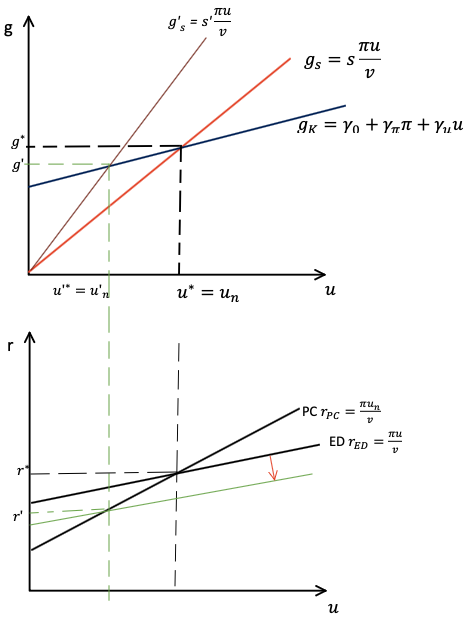
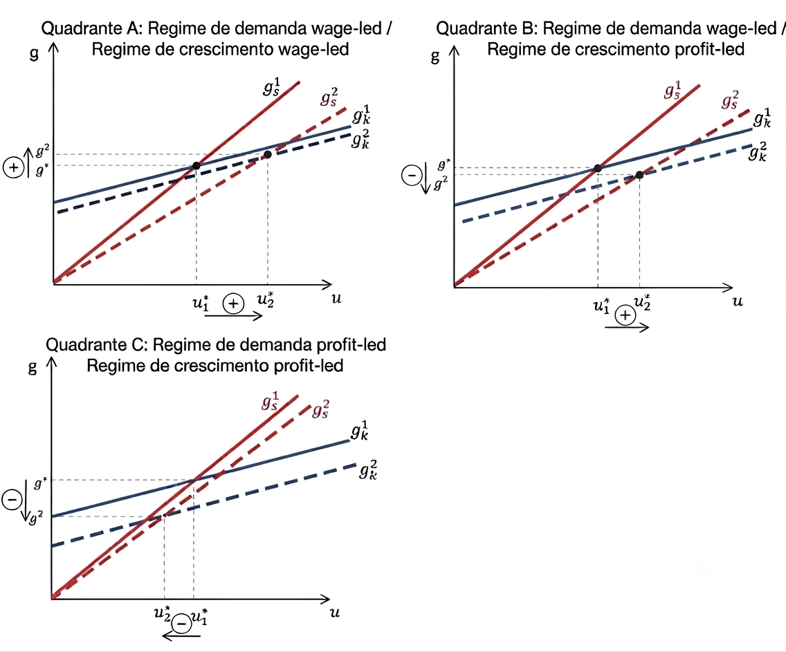

# Modelo Neo-Kaleckiano (Bhaduri e Marglin) {#sec-modelo-bm}

## Introdução {#sec-introducao-bm}

O modelo neokaleckiano desenvolvido por Bhaduri e Marglin representa uma
das principais extensões da tradição kaleckiana de crescimento e
distribuição. Seu objetivo é incorporar, de forma explícita, o efeito da
distribuição funcional da renda sobre as decisões de investimento,
permitindo analisar diferentes regimes de demanda e crescimento.

O modelo parte da estrutura do modelo kaleckiano canônico, mas modifica
a função de investimento ao introduzir a participação dos lucros na
renda (*profit share*) como um determinante autônomo do investimento
desejado. Essa modificação torna possível distinguir economias em que
aumentos da parcela dos lucros estimulam a atividade econômica daquelas
em que o crescimento é favorecido pelo aumento da participação dos
salários.

Ao final deste capítulo veremos que essa alteração aparentemente simples
produz resultados bastante ricos, permitindo diferenciar:

- regimes de demanda *wage-led* e *profit-led*;
- regimes de crescimento *wage-led* e *profit-led*;
- situações em que demanda e crescimento respondem de maneira distinta
  às mudanças distributivas.

## A crítica ao modelo kaleckiano canônico {#sec-critica-bm}

Este modelo parte da estrutura do modelo canônico, mas estabelce uma
divergênica importante a partir de uma crítica à função de investimento.
Bhaduri e Marglin apontaram que o modelo canônico de crescimento
kaleckiano superestima o papel da demanda efetiva e subestima o papel da
distribuição de renda sobre o investimento.

No modelo kaleckiano apresentado no capítulo anterior, o investimento
depende positivamente do grau de utilização da capacidade produtiva.
Para fins de praticidade, representaremos função de investimento
conforme o capítulo anterior do modelo canônico:

$$g_{K}=\gamma_0+\gamma_r r + \gamma_u u$$

em que:

- $\gamma_0$ representa o componente autônomo do investimento;
- $\gamma_u>0$ mede a sensibilidade do investimento ao grau de
  utilização da capacidade;
- $u$ representa o grau de utilização.

Se lemrbarmos que $r=\frac{\pi u}{v}$, podemos reescrever a equação
acima como:

$$\begin{aligned}
g_K=\gamma_0 + \gamma_r \frac{\pi u}{v} + \gamma_u u \\
g_K = \gamma_0 + \left(\gamma_r \frac{\pi}{v}+\gamma_u \right) u
\end{aligned}$$ {#eq-gkcanonico}

em que $\pi$ representa a participação dos lucros na renda e $v$
corresponde à relação capital-produto.

Uma crítica inicial é que, conforme podemos constatar na @eq-gkcanonico,
o grau de utilização da capacidade tem impacto duplo sobre o
investimento. Quando a demanda efetiva aquece $(u\uparrow)$, as firmas
aumentam o investimento tanto pelo efeito acelerador como pelo efeito
lucratividade (ver termo entre parênteses na @eq-gkbm).

Essa especificação sugere que o impacto será sempre amplificado, pois
pressupõe que sempre temos $\gamma_u > 0$. Entretanto, essa relação
positiva entre grau de utilização e investimento possui uma relação
implícita nada trivial. O fato de $\gamma_u$ se sempre positivo pode ser
interpretado como: *tudo o mais constante* (**inclusive a taxa de
lucro**), o aumento do grau de utilização conduz ao aumento da taxa de
investimento.

Repare que manter a taxa de lucro constante após ocorrer o aumento do
grau de utilização só será possível se houver um aumento proporcional da
participação dos lucros na renda. Isso é mais fácil de ser verificado
pela representação algébrica:

$$\bar{r} = \frac{\pi \downarrow u\uparrow}{v}$$

No entanto, devemos lembrar que a parcela dos lucros na renda é
diretamente relacionada com a taxa de *markup* (ver @eq-pi). Ou seja, a
relação descrita acima sugere que o modelo kaleckiano admite,
implicitamente, que uma firma pode observar uma redução do seu *markup*
e, ainda assim, decidir ampliar seus investimentos devido ao grau de
utilização permanecer elevado.

Bhaduri e Marglin questionam precisamente essa hipótese.

::: callout-important
### A crítica de Bhaduri e Marglin

Os autores argumentam que as firmas não observam apenas o grau de
utilização da capacidade ao decidir investir.

A distribuição funcional da renda (refletida na participação dos lucros
ou, equivalentemente, no *markup*) também influencia as expectativas de
rentabilidade futura.
:::

## A função de investimento de Bhaduri e Marglin {#sec-investimento-bm}

Como alternativa, Bhaduri e Marglin retomam a tradição inaugurada por
Joan Robinson. Segundo essa abordagem, o investimento depende da **taxa
de lucro esperada**, e não apenas da taxa de lucro realizada.

Assumindo uma relação capital-produto constante, a taxa de lucro
esperada depende positivamente de:

- o grau de utilização da capacidade produtiva: $u$;
- a participação dos lucros na renda: $\pi$.

Uma representação linear dessa hipótese pode ser escrita como:

$$g_K= \gamma_0 + \gamma_{\pi}\pi + \gamma_u u$$ {#eq-gkbm}

em que

- $\gamma_{\pi}>0$; mede a sensibilidade do investimento à distribuição
  funcional da renda;
- $\gamma_u>0$; representa a resposta ao grau de utilização.

Nesta versão, a decisão de investimento depende não da taxa de lucro
realizada, mas da distribuição de renda desejada. Mesmo o $\gamma_u$
sendo positivo, como antes, ele já não mais pressupõe a manutenção da
taxa de lucro, pois o que influencia o investimento é a parcela dos
lucros, não sua taxa. Desta forma, pode ocorrer de a taxa de lucro
realizada ficar abaixo da que seria compatível com o markup desejado
pelas firmas, fato que desestimularia novos investimentos e reduziria a
taxa de crescimento do estoque de capital por meio do parâmtero
$\gamma_\pi$.

Quando $\gamma_{\pi}=0$, a @eq-gkbm reduz-se aproximadamente à função de
investimento estudada no capítulo anterior. Aqui, basicamente, temos
duas forças oeprando sobre o investimento. De um lado, a demanda efetiva
aquecida estimula o investimento via efeito acelerador, enquanto que,
por outro lado, o aumento da parclea salarial (*wage-share*)
desestimnula o investimento via efeito lucratividade. O resultado
líquido sobre a taxa de crescimento do investimento dependerá de qual
destes efeitos preponderará.

## O equilíbrio do modelo {#sec-equilibrio-bm}

A condição de equilíbrio continua sendo dada pela igualdade entre
poupança e investimento. Neste caso, igualdade entre taxa de poupança e
taxa de investimento:

$$g_{s}=g_{K}.$$

Assumindo a função de poupança apresentada pela @eq-gs e já substituindo
$r$ chegamos em:

$$g_s=\frac{s_\pi\pi u}{v},$$ {#eq-gs-bm}

e substituindo a Equação @eq-gkbm, obtemos

$$\frac{s\pi}{v}u=\gamma_0+\gamma_{\pi}\pi+\gamma_u u$$

Isolando o grau de utilização de equilíbrio,

$$u^{*}=\frac{\gamma_0+\gamma_{\pi}\pi}{\dfrac{s_\pi \pi}{v}-\gamma_u}$$ {#eq-u-bm}

Esta expressão mostra que o grau de utilização depende simultaneamente
da distribuição funcional da renda e da sensibilidade do investimento
tanto à parcela dos lcuros, quanto à demanda.

A linearidade assumida, apesar de beneficiar a matemática, traz algumas
contradições que precisamos lidar. A primeira dela é que calcular a
derivada aqui não será equivalente ao resultado obtido pelo Bhaduri e
Marglin. Mas, para fins didáticos, abriremos mão do rigor matemático
para elucidar o resultado de Bhaduri e Marglin.

Para fins didáticos, repare que a parcela dos lucros na renda entra
tanto no numerador quanto no denominador do grau de utilização e seu
efeito sobre esta variável dependerá de dois parâmetros principais. Por
um lado, a concentração de renda nos lucros amplia o investimento e
aquece a demanda pelo efeito lucratividade. Só que, por outro lado, esta
mesma concentração de renda em favor dos que tem maior propensão a
poupar (portanto, consomem menos) desaquece a demanda pelo efeito
acelerador. O resultado líquido dependerá de qual efeito preponderará ao
final da mudança na distribuição de renda.

Caso $\gamma_u > \gamma_\pi$, o fato de o efeito acelerador ser maior
que o efeito da lucratividade garante uma relação inversa entre
profit-share e grau de utilização, indicando que a economia desacelera
quando a renda se concentra nos lucros e vice-versa. Assim, dizemos se
tratar de um regime de **demanda wage-led**, ainda que sem propensão a
poupar dos salários.

::: callout-note
### Regime de demanda *wage-led*

Quando

$$\frac{\partial u^{*}}{\partial\pi}<0,$$

um aumento da participação dos salários eleva o grau de utilização da
capacidade.

Dizemos que a economia apresenta um regime de demanda **wage-led**.
:::

Caso $\gamma_\pi > \gamma_u$, faz com que o efeito lucratividade
prepondere sobre o efeito acelerador, garantindo uma relação direta
entre concentração de renda em favor dos lucros e grau de utilização.
Este resultado sugere que o efeito sobre investimento, provocado pelo
aumento do mark-up, mais que compensa a queda do consumo, provocada pela
queda na parcela dos salários. Assim, temos um **regime de demanda
profit-led**, em que a demanda sobe sempre que os salários caem.

::: callout-note
### Regime de demanda *profit-led*

Quando

$$\frac{\partial u^{*}}{\partial\pi}>0,$$

uma redistribuição da renda em favor dos lucros amplia a demanda
agregada.

Nesse caso, a economia encontra-se em um regime de demanda
**profit-led**.
:::

::: callout-note
### Sobre a contradição adotada na linearidade hipotética

Repare que dividirmos todo mundo na equaçãoa cima por $\pi$ fico com:
$$u=\frac{\frac{\gamma_0}{\pi} + \gamma_\pi}{\frac{s_\pi}{v}-\frac{\gamma_u}{\pi}}$$
Neste caso, a ambiguidade desaparece e a única possibilidade é um regime
de demanda wage-led. O mesmo aconteceria se eu calculasse a derivada
parcial de $u$, obtendo:
$$\frac{\delta u^{*}}{\delta \pi}= - \frac{\gamma_\pi \gamma_u +\gamma_a \frac{s}{v}}{\left( 
s_\pi \frac{\pi}{v} - \gamma_u \right)^2}<0$$ A razão disso é que a
simplicidade assumida gerou um efeito linear da concentração de renda
sobre o investimento, mas um efeito não linear sobre o consumo, por
causa do efeito acelerador. Ou seja, é uma simplicidade útil para fins
didáticos, mas que causa complicações não fidedignas ao modelo de BM.
:::

Seguindo com nossa derivação do equilíbrio, temos de substituir o
resutlado encontrado para o grau de utilização na @eq-gkbm, o que nos
leva à:

$$g^*=\gamma_0 + \gamma_{\pi}\pi +\gamma_u \left(\frac{\gamma_0+\gamma_\pi \pi}{s_\pi\frac{\pi}{v}-\gamma_u}\right)$$ {#eq-g-bm}

A principal inovação do modelo consiste em mostrar que alterações
distributivas podem produzir efeitos distintos sobre a demanda agregada
e sobre o crescimento. A depender do regime de demanda, poderemos
determinar qual será o regime de crescimento.

Para casos de regime de demanda *profit-led*, a análise fica bem
simples. Pois se o último termo da equação já responder positivamente ao
aumento de $\pi$, o segundo termo só amplificará a dimensão do impacto.
Assim, se tivermos um regime de demanda profit-led, o regime de
crescimento também será profit-led. O que os autores chamam de
Exhilarationist.

Para casos de regime de demanda wage-led, a contradição aparece. Se o
ultimo termo da equação responde negativamente ao aumento de $\pi$, o
resultado sobre o crescimento dependerá do efeito da lucratividade sobre
o investimento. Se o segundo termo compensar, em magnitude, o terceiro
termo, o crescimento responderá positivamente ao aumento da parcela dos
lucros na renda. Assim, temos o caso de um regime de demanda wage-led,
mas um **regime de crescimento profit-led**. 

::: callout-note
### Regime de crescimento *profit-led*

Quando

$$\frac{\partial g^{*}}{\partial\pi}>0,$$ uma redistribuição da renda em
favor dos lucros amplia a demanda agregada.

Nesse caso, a economia encontra-se em um **regime de crescimento
profit-led**. 
:::

Contudo, se o efeito da lucratividade sobre o investimento não for
grande o suficiente para compensar o efeito acelerador, o crescimento
declinará, mesmo com o segundo termo sendo positivo. Isso produziria um
**regime de crescimento wage-led**, assim como o regime de demanda.

::: callout-note
### Regime de crescimento *wage-led*

Quando

$$\frac{\partial g^{*}}{\partial\pi}<0,$$

uma redistribuição da renda em favor dos salários amplia a demanda
agregada.

Nesse caso, a economia encontra-se em um regime de crescimento
**wage-led**.
:::

A tabela a seguir resume as possibilidades de combinação entre regimes
de demanda e regimes de cresimento:

|  |  |  |  |
|:------------------|:----------------:|:----------------:|:----------------:|
| **Sinais das derivadas parciais** | Regime de demanda e crescimento liderados pelos salários | Regime de demanda liderado pelos salários e de crescimento liderado pelos lucros | Regime de demanda e de crescimento liderados pelos lucros |
| $\partial u^*/\partial\pi$ | $-$ | $-$ | $+$ |
| $\partial g^*/\partial\pi$ | $-$ | $+$ | $+$ |

: Combinações de regimes de demanda e de crescimento {#tbl-regimes}

Em suma, este modelo permite dois tipos distintos de regime de demanda e
de crescimento. Esse resultado decorre da existência de dois efeitos
opostos.

Por um lado, um aumento da parcela dos lucros reduz o consumo, uma vez
que os capitalistas possuem maior propensão a poupar.

Por outro lado, uma maior participação dos lucros estimula o
investimento ao elevar a rentabilidade esperada.

O efeito líquido dependerá dos parâmetros do modelo.

Este resultado foi usado pela literatura para analisar que padrões
econômicos wage-led geram um ambiente de ganha-ganha no conflito, em que
os capitalistas tendem a ter menor resistência à queda na participação
da renda. Em certa medida, ainda que a participação na renda esteja
caindo, o ritmo de acumulação segue aquecido, amenizando os efeitos
distributivos.

Mas economias que apresentam um regime de demanda wage-led e crescimento
profit-led estimula o conflito, pois ao buscar maiores taxas de
acumulação, os capitalistas desaquecem a economia. O conflito social
torna-se mais evidente, uma vez que os ganhos de uma classe implicam,
necessariamente, ônus para outra.

## Analisando o equilíbrio com gráficos

::::: columns
::: {.column width="35%"}
{#fig-eqbm width="100%"}
:::

::: {.column width="65%"}
A representação gráfica deste modelo, inicialmente, não se altera tanto
em relação à versão canônica do modelo.

De um lado, temos uma reta de crescimento da poupança positivamente
relacionada ao grau efetivo de utilização da capacidade instalada,
representando a @eq-gs-bm.

Por outro lado, a reta de investimento também responde positivamente ao
grau de utilização, além da distribuição de renda, conforme a @eq-gkbm.

A interseção dessas duas curvas determina o equilíbrio simultâneo entre
crescimento e utilização da capacidade. O que pode ser imediatamente
transportado para o quadrante inferior da @fig-eqbm.
:::
:::::

O que vemos na parte inferior é o encontro das curvas PC e ED,
representando a curva de Phillips e a de demanda efeitva
respectivamente. Enquanto a primeira (PC) é calculada com base no grau
desejado de utilização, onde as firmas atingem o *markup* desejado, a
segunda registra a taxa de lucro efetivada a partir da demanda
realizada.

No equilíbrio, a dinâmica do grau de utilização garante a convergência
destas taxas de lucro $(r_{PC}=r_{ED}).$ Sempre que a poupança crescer
mais rápido que o investimento $(g_s>g_K)$, a taxa de lucro realizada
pelas firmas estará menor do que àquela que equilibraria o conflito
distributivo $(r_{ED}<r_{PC})$. Nestas circunstâncias, as firmas
deixarão de realizar novos investimentos, reduzindo o grau de utilização
em direção ao normal.

Sempre que o investimento crescer mais rápido que a poupança
$(g_K>g_s)$, o grau de utilização tende a se elevar. Com a demanda
efetiva gerando uma taxa de lucro realizada superior àquela que
equilibraria o conflito distributivo $(r_{ED}>r_{PC})$. A diferença
deste modelo reside no fato de que, agora, a parcela dos lucros na renda
influencia tanto a inclinação da taxa de crescimento da poupança (ver
@eq-gs-bm), quanto a taxa de crescimento do investimento (ver @eq-gkbm).
Portanto, alterações na distribuição de renda terão efeito de:

- rotacionar a reta de crescimento da poupança $(g_s)$

- deslocar a reta de crescimento do investimento $(g_K)$

## Paradoxo dos custos e da parcimônia

Assim como discutido na @sec-paradoxos-kal, temos que analisar os
paradoxos dos custos e da parcimônia (Thrifit) no fechamento
neo-kaleckiano.

::: callout-note
### Lembrando os conceitos:

Paradoxo dos custos $\rightarrow$ sugere que o aumento dos salários, ao
aquecer a demanda efetiva, teria o resultado macroeconômico de elevar a
taxa de lucro das firmas.

$$\frac{\partial r}{\partial \pi} < 0 $$

Paradoxo da parcimônia $\rightarrow$ sustenta que o aumento da propensão
marginal a poupar, ao desaquecer a demanda efetiva, teria impacto
negativo sobre a taxa de investimento e, portanto, sobre a poupança
macroecômica.

$$\begin{aligned}
\frac{\partial u}{\partial s} < 0\\ 
\& \\
\frac{\partial g}{\partial u} >0
\end{aligned}$$
:::

:::::::: columns
::: {.column width="35%"}
{width="100%"}
:::

::: {.column width="65%"}
O paradoxo de Thrifit segue válido no modelo neo-kaleckiano de Bhaduri e
Marglin.

Graficamente podemos constatar isso pela rotação que a mudança da
propensão a poupar causa na @eq-gs-bm. A curva $g_s$ rotaciona para
dentro e intercepta a curva $g_K$ em um novo ponto de equilíbrio, com
menores taxas de crescimento e de demanda.

Intuitivamente, temos que o aumento da propensão a poupar derruba o
consumo e reduz a demanda efetiva o que, para um dado *markup* desejado,
faz com que as firmas optem por reduzir a taxa de crescimento dos
investimentos e manter sua parcela dos lucros na renda, ainda que com
menor taxa de lucro.

$$ s_\pi\downarrow \rightarrow g_s\downarrow \rightarrow u\downarrow \rightarrow g_K\downarrow \rightarrow u_n\downarrow $$
:::

Algebricamente, não precisamos derivar para notar que o aumento de
$s_\pi$ na @eq-u-bm leva ao aumento do denominador, fato que reduz a
razão. Ou seja, elevar $s_\pi$ reduz $u^*$. Concomintantemente, pela
@eq-gkbm vemos que a queda de $u$, tudo o mais constante, leva à queda
de $g_K$.

Assim, as duas condições para que o paradoxo de Thrifit ocorra foram
satisfeitas.

Já o paradoxo dos custos passa a ter um resultado ambíguo nesta versão
do modelo. Graficamente, vemos dois movimentos simultâneos:

- deslocamento da reta da taxa de investimentos $(g_K)$

- rotação da reta da taxa de poupança $(g_s)$

{#fig-custos-bm width="100%"}

A @fig-custos-bm ilustra o efeito de um aumento da parcela dos salários na renda em três
casos distintos. Se lembramos da @eq-r, é fácil notar que para a taxa de lucro subir 
após o aumento dos salários (queda da parcela dos lucros), é preciso que o grau de
utilização suba mais que proporcionalmente. Em outras palavras, o paradoxo dos custos
só será verificado em um regime de demanda *wage-led*. A seguir, vamos estudar esta 
relação entre parcela dos salários na renda e grau de utilização.

Como trata-se de um gráfico bidimensional, que considera $u$ e $g$, podemos
pensar na mudança de $\pi$ na @eq-gkbm como uma mudança de intercepto da reta $g_K$. 
Neste caso, o aumento dos salários é equivalente à queda da parcela dos lucros, portanto,
diminuição do intercepto e, por isso, vemos um deslocamento para baixo da reta $g_K$.

Concomitantemente, ao olhar para @eq-gs-bm como uma equação linear, podemos notar que o
$\pi$ funciona como um coeficiente angular da reta. Ou seja, a queda do $\pi$ reduz o 
coeficiente angular de uma função de primeiro grau, reduzindo sua inclinação (rotacionando no sentido horário). 
Em outras palavras: tornado a reta do plano cartesiano mais "deitada".

O Quadrante A mostra que após a rotação da curva $g_S$ no sentido horário e o deslocamento
para baixo de $g_K$, o novo equilíbrio se dá em um ponto compatível com maior grau de 
utilização e maior taxa de crescimento. Enquanto o primeiro resultado denota um regime
de demanda liderado por salários, o segundo deve ser lido como um regime de crescimento
liderado pelos salários.

Em uma economia totalmente *wage-led*, o conflito distributivo fica menos intenso, já 
que o aumento dos salários leva ao aumento do ritmo de acumulação do capital. Neste caso,
o paradoxo dos custos pode ser verificado no curto e no longo-prazo.

::: {.callout-warning}

### Atenção

Observe que o resultado do **Quadrante A** depende de um deslocamento relativamente pequeno da curva $g_K$ e de uma rotação mais acentuada da curva $g_S$.

Em termos econômicos, isso significa que o aumento da participação dos salários na renda exerce apenas um efeito limitado sobre as expectativas de lucratividade dos empresários, enquanto o estímulo ao consumo e à demanda efetiva é suficientemente forte para elevar o grau de utilização da capacidade instalada. Nessas circunstâncias, o efeito acelerador sobre o investimento supera o efeito lucratividade, permitindo a ocorrência de um regime de demanda e crescimento liderado pelos salários (*wage-led*).

:::

Como podemos notar pela @eq-gkbm, o tamanho do deslocamento da curva de
investimentos dependerá diretamente do quão sensível o investimento é em
relação à distribuição de renda (representado pelo parâmero $\gamma_\pi$).
Quanto mais sensível for, maior será o deslocamento da reta $g_K$, aumemtando 
as chances de um regime de demanda profit-led (para dado $\gamma_u$).

Em suma e simplificadamente, o efeito líquido de uma distribuição de renda em favor 
dos salários dependerá do efeito líquido entre o efeito lucratividade $(\gamma_\pi)$ 
e o efeito acelerador $(\gamma_u)$. Quanto maior for o efeito acelerador em relação ao
efeito lucratividade, maiores serão as chances de termos um regime de demanda e crescimento
liderado pelos salários (*wage-led*).

O Quadrante B da @fig-custos-bm representa um modelo de demanda wage-led, mas um regime
de crescimento profit-led. Isto porque, apesar de o grau de utilização crescer após o 
aumento da parcela dos salários, isso não é suficiente para compensar a 
desaceleração do investimento puxada pela consequente queda da parcela dos lucros.

Neste caso, a validade do paradoxo dos custos dependerá de o aumento do grau de utilização 
compensar a queda da parcela dos lucros na renda, a ponto de aumentar a taxa de lucro.
Mais uma vez, menores serão as chances disso acontecer, quanto maior for o efeito lucratividade
do investimento, capturado pelo parâmetro $\gamma_\pi$. Aqui vemos como um regime de 
demanda liderado pelos salários é condição necessária, mas não suficiente para assegurar 
que o regime de crescimento também seja liderado pelos salários (como vimos na @tbl-regimes).

Por fim, o Quadrante C da @fig-custos-bm mostra que após o aumento da parcela dos salários, o novo equilíbrio
ocorre já com o grau de utilização menor do que o inicial, caracterizando o regime de demanda
como liderado pelos lucros (*profit-led*). Nestas circunstância, não tem como o regime de 
crescimento não ser liderado pelos lucros também, já que o efeito sensibilidade do 
investimento se mostrou significativo ante o efeito acelerador, provocando um forte 
deslocamento da curva $g_K$. O paradoxo dos custos não é válido neste contexto.

Trabalhos empíricos conduzidos por autores neokaleckianos tendem a mostrar um efeito
acelerador bem alto, enquanto estimações apontam para um baixo efeito lucratividade. 
Isto é, o investimento parece ser mais sensível à demanda do que à lucratividade. 

Intuitivamente, esta combinação de parâmetros, verificados empiricamente, aumenta o efeito 
expansionista causado pela distribuição de renda e minimiza o efeito contracionista causado pelo 
desestímulo ao investimento devido a esta mesma distribuição.

## Seção de estudo interativo {#sec-estudo}

O gráfico abaixo permite explorar, de forma interativa, os efeitos de alterações na propensão a poupar e na distribuição funcional da renda sobre o equilíbrio do modelo neokaleckiano de Bhaduri e Marglin. Utilize os controles deslizantes para modificar os parâmetros e observe como as curvas e o ponto de equilíbrio se alteram.

::: {.callout-tip}
### Como utilizar o simulador

**Paradoxo da parcimônia**

- Altere o *slider* vermelho correspondente à propensão a poupar ($s$).
- Observe a rotação da curva de poupança ($g_S$).
- Compare a posição inicial (linha contínua) com a posição final (linha tracejada).

**Paradoxo dos custos**

- Altere o *slider* verde correspondente à participação dos salários ($w$).
- Observe simultaneamente:
  - a alteração da inclinação da curva de poupança;
  - o deslocamento da curva de investimento, dada pela @eq-gkbm;
  - o novo ponto de equilíbrio.
:::

::: {.callout-important}
### O que observar?

Durante a utilização do simulador, procure responder às seguintes questões:

- Quais curvas se alteram quando aumenta a propensão a poupar (olhe o gráfico inferior também)?
- O aumento da participação dos salários desloca ou rotaciona as curvas?
- O que determina os regimes de demanda e de crescimento do modelo?
:::

::: {.callout-important appearance="minimal"}

<iframe
  scrolling="no"
  title="Modelo Neokaleckiano wage-led"
  src="https://www.geogebra.org/material/iframe/id/kyjszhnv/width/1499/height/835/border/ffffff/sfsb/true/smb/false/stb/false/stbh/false/ai/false/asb/false/sri/false/rc/false/ld/false/sdz/false/ctl/false"
  width="1499%"
  height="835px"
  style="border: none !important; overflow: hidden; display: block;"
  frameborder="0">
</iframe>

:::

::: {.callout-note}
### Exercício

Após explorar diferentes valores para $s$ e $w$, explique, com suas próprias palavras, os mecanismos econômicos responsáveis pelas alterações observadas.

Sua resposta deve apresentar uma sequência lógica de causalidade, identificando:

1. qual parâmetro foi alterado;
2. quais curvas foram modificadas;
3. por que essas curvas se deslocaram ou rotacionaram;
4. como essas alterações afetaram o grau de utilização da capacidade e a taxa de crescimento;
5. Qual é o regime de demanda e de crescimento em cada caso.

Evite apenas descrever o gráfico. Procure trazer a intuição econômica representada pelo modelo.
:::

Agora, refaça o exercício anterior considerando o contexto do modelo abaixo. 
A diferença entre os dois modelos são apenas os parâmteros $\gamma_\pi$ e $\gamma_u$.
Na versão abaixo, o investimento se mostra muito mais sensível à mudanças da 
distribuição de renda e a taxa de poupança menos sensível a esta mesma variável.

Repare que o regime de demanda e de crescimento não são o mesmo neste contexto.
Faça o exercício e tente identificar as principais características presentes 
nesta representação. Explore os dois paradoxos para aplicar o conhecimento construído
ao longo deste capítulo.

<iframe
  scrolling="no"
  title="Modelo Neokaleckiano profit-led"
  src="https://www.geogebra.org/material/iframe/id/jhabpd4r/width/1499/height/835/border/ffffff/sfsb/true/smb/false/stb/false/stbh/false/ai/false/asb/false/sri/false/rc/false/ld/false/sdz/false/ctl/false"
  width="1499%"
  height="835px"
  style="border: none !important; overflow: hidden; display: block;"
  frameborder="0">
</iframe>
